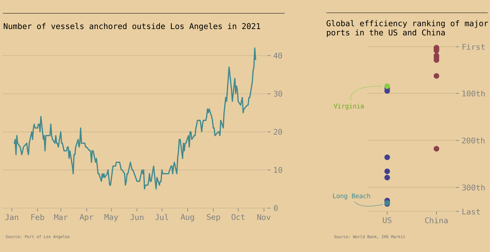

The supply chain crisis continues to illuminate unseen and underappreciated parts of the economy. This time it's ports, where ships have been facing long lines across the US. California has been the worst affected state, with cargo waiting as long as 12 days in the San Pedro Bay.

While the lines are new, the underlying problems are not. US ports are often inefficient due to heavy regulation, poor infrastructure, and low automation. The Los Angeles-Long Beach ports can only operate 16 hours a day compared to the 24/7 service in China. The ILA Union, which represents dock workers, has successfully blocked automation efforts across the country. However not all ports have been held back. Virginia is significantly more efficient thanks to a decade of government investment and a focus on automation. 60 semi- autonomous cranes glide across the yard with 18 more coming in 2023. This effort has helped Virginia avoid the current crisis.

Long term decision making has been worse elsewhere. Frustration around government inactivity has created rogue supply chain detectives. Ryan Peterson, CEO of logistics startup Flexport, rented a boat last week to take a look at the Port of Long Beach first hand. In his 3 hour cruise he noted that the main bottleneck was a lack of storage and recommended allowing containers to be stacked higher. Within 8 hours of tweeting his experience the City of Long Beach announced they would temporarily double the container stacking limit from 2 to 4. While the fast reaction was welcomed, this simple fix should have been spotted sooner.

Long Beach’s Mayor isn't alone in reacting to the crisis. Gavin Newson, Governor of California, signed an executive order on October 20th forcing government departments to find suitable land for container storage. This move will help alleviate the current crisis, but it won't solve the underlying inefficiencies. If the US wants to compete in global trade, it needs to make tough long term decisions and understand automation is here to stay.

*This article was written on October 24th 2021 in the style of The Economist's Daily Chart.*
