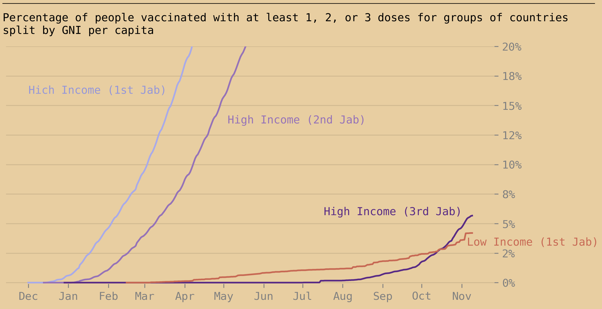

As the booster vaccine rollout accelerates in rich countries, poor countries continue to face difficulties procuring initial vaccines. In mid-October the rate of people with 3 doses in rich countries was higher than the rate with 1 dose in poor countries.

A booster vaccine is simply an additional dose of one of the existing vaccines. This means every 3rd jab could also be given to a different person as a 1st or 2nd jab. These boosters are highly effective, [a trial of over 10,000 people](https://www.pfizer.com/news/press-release/press-release-detail/pfizer-and-biontech-announce-phase-3-trial-data-showing) showed the relative efficacy of a third Pfizer jab was 95.6% compared to two doses. However first and second jabs are much more important for saving lives as they massively reduce the chance of mortality. This means an unequal distribution of vaccines will cause great unnecessary death.

COVAX, the initiative intended to give poorer countries a competitive chance in the vaccine market, has underperformed. [Current forecasts](https://www.gavi.org/sites/default/files/covid/covax/COVAX-Supply-Forecast.pdf) estimate it’ll deliver 1.4 billion doses by the end of 2021, well below its [initial goal](https://www.who.int/news/item/27-05-2021-covax-joint-statement-call-to-action-to-equip-covax-to-deliver-2-billion-doses-in-2021) of 2 billion. Much of the delays are caused by slow procurement early in the pandemic when rich countries were racing to buy as many vaccines as possible. This places rich countries [ahead in the queue](https://news.un.org/en/story/2021/09/1099422). This has paid off in rich countries where booster rollouts are accelerating.

Successful rollouts mean rich countries are unlikely to budge. There is little political incentive for leaders to give up their own vaccine supplies or modify contracts with suppliers. As winter comes in, boosters will be key for preventing new lockdowns. Hoarding vaccines gives a bad image on the world stage but it’s much more valuable for politicians to successfully control COVID at home.

Rich countries cannot simply wait for supply to increase. [According to UNICEF](https://www.unicef.org/supply/covid-19-vaccine-market-dashboard) the productive capacity for all COVID vaccines is 12 billion doses across 2021. This goes up to 40 billion in 2022. If booster shots are to be administered every 6 months then this capacity increase must happen as soon as possible, and fairer distribution must happen sooner. Failure to do so will prevent low income countries from recovering economically and will cause a massive loss of life.

*This article was written on November 10th 2021 in the style of The Economist's Daily Chart. Data for the chart taken from [Our World in Data](https://github.com/owid/covid-19-data/tree/master/public/data/vaccinations).*